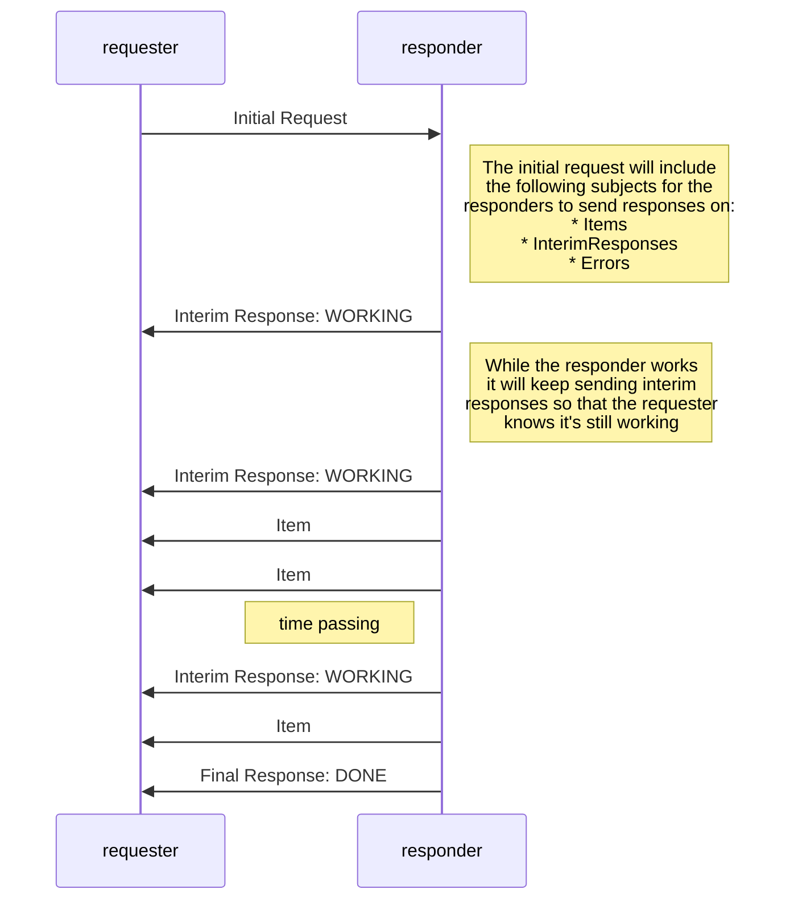
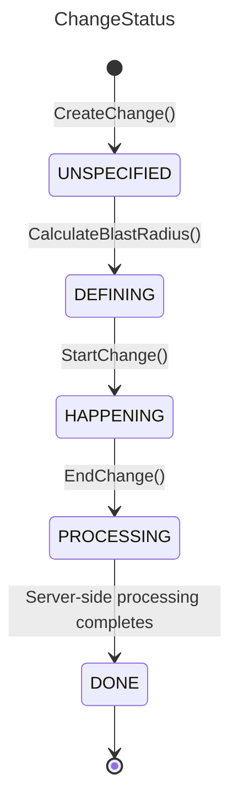

# State Description Protocol

State Description Protocol is designed to allow for the serialization of the description of the current state of a computer system for the purposes of auditing, monitoring etc. It is deliberately simplistic and is designed to transmit the details of things that we don't know the importance of. For this reason it doesn't contain dedicated ways of describing files, packages etc. since it doesn't presume to know what it is describing, other than the fact that it is "state".

This has been somewhat inspired by [Z Notation](https://en.wikipedia.org/wiki/Z_notation)

Below is an example of an `Item` in SDP serialized as JSON for readability:

```json
{
    "type": "dns",
    "uniqueAttribute": "name",
    "attributes": {
        "attrStruct": {
            "ips": [
                "2606:4700:4700::1001",
                "2606:4700:4700::1111",
                "1.0.0.1",
                "1.1.1.1"
            ],
            "name": "one.one.one.one"
        }
    },
    "scope": "global",
    "linkedItemQueries": [
        {
            "type": "ip",
            "query": "2606:4700:4700::1001",
            "scope": "global",
            "method": "GET"
        },
        {
            "type": "ip",
            "query": "2606:4700:4700::1111",
            "scope": "global",
            "method": "GET"
        },
        {
            "type": "ip",
            "query": "1.0.0.1",
            "scope": "global",
            "method": "GET"
        },
        {
            "type": "ip",
            "query": "1.1.1.1",
            "scope": "global",
            "method": "GET"
        }
    ]
}
```

## Attributes

The attributes of an item convey all information about that item. The `attrStruct` contains string keys and values of any type as long as they are supported by [`google.protobuf.Struct`](https://developers.google.com/protocol-buffers/docs/reference/google.protobuf#google.protobuf.Struct).

### Naming Convention

**Attributes:** It is convention that the names of attribute keys follow `camelCase` with the first letter lowercase. Child keys should also follow this convention unless it is returning information that has been returned directly form the underlying system in an already-structured format, in this case it is at the developer's discretion whether to use camel case or keep the existing case.

## Additional Dynamic Data

Other than the methods that are are generated from the protocol buffers, we provide the following methods for convenience on all platforms. Certain libraries may provide more functionality above the methods listed below but these methods at least will be present and return consistent results across all libraries. Not however that the naming of the methods might change to reflect best-practices in a given library.

### `item.UniqueAttributeValue`

Returns the value of whatever the Unique Attribute is for this item

### `item.Reference`

Returns an SDP reference for the item

### `item.GloballyUniqueName`

GloballyUniqueName Returns a string that defines the Item globally. This a
combination of the following values:

* scope
* type
* uniqueAttributeValue

They are concatenated with dots (.)

### `reference.GloballyUniqueName`

Same as for Item

### `item.Hash`

Returns a 12 character hash for the item. This is likely but not guaranteed to be unique. The hash is calculated as follows:

* Take the SHA-1 sum of the GloballyUniqueName
* Encode the SHA-1 binary value using base-32 with a custom encoding
  * The custom encoding is designed to ensure that all hashes are also valid variable names in DGraph and other databases. To this end the following encoding string is used: `abcdefghijklmnopqrstuvwxyzABCDEF`
  * The encoding is also non-padded, though this likely wont matter since we strip the end off anyway
* Return the first 12 characters of the resulting string

### `reference.Hash`

Same as item.Hash

## Querying State

SDP is designed to be usable over a message queue infrastructure where a single request may be responded to by many, many respondents. In order to have this process work efficiently and provide a reasonable amount of feedback to the user about how the query is going and how much longer it might be expected to take, interim responses are used.

An interim response is designed to give the requester the following information:

* How many responders are currently working on the request
* If responders have stopped responding or whether they are just taking a long time to execute the query
* When things have finished

The communication looks as follows:



The subjects upon which the responses and items should be sent are determined by the requester and sent within the request itself. The naming conventions for this are found below.

## Item Uniqueness

An item is considered unique with a unique combination of:

* Type
* UniqueAttributeValue
* Scope

While the UniqueAttributeValue will always be unique for a given type, this same item may exist in many scopes. AN example could be the same package installed on many servers, or the same deployment in many Kubernetes namespaces. Hence scope is required to ensure uniqueness globally.

## Message Queue Topics/Subjects

When implementing SDP over a message queue (usually NATS), you should follow the below naming convention for topics/subjects. Note that the naming of subjects shouldn't influence how messages are actually handled, for example a `Query` that came though the subject `request.all` should be treated the same as one that come from `request.scope.{scope}`. All of the information needed for the processing of messages is contained in the message itself and the subjects are currently only used for convenience and routing.

### `request.all`

Everything will listen on this subject for requests. Requests sent to this subject should have a `scope` of `*` and will therefore be responded to by everything. It is of course possible to send a request to this subject that has only one specific scope, but this would be incredibly wasteful of network bandwidth as the message would be relays to all consumers and then discarded by all but one.

### `request.scope.{scope}`

All sources should listen on a subject named with the above naming conventions for all scopes that they are able to find items for. In some cases, such as agent-based sources in a physical server or VM this will likely only be one e.g. `request.scope.webserver01`. However some sources may be able to connect to many scopes and will therefore subscribe to one subject for each. An example could be a Kubernetes source which is able to connect to many namespaces. Its subscriptions could look like:

* `request.scope.cluster1.namespace1`
* `request.scope.cluster1.namespace2`

Dots are valid in scope names and should be used for logical serration as above.

### `query.{uuid}`

All items, errors and status updates get sent over a subject named after the Query's UUID. This UUID should be in five groups separated by hyphens, in the form 8-4-4-4-12 for a total of 36 characters, with all letters being lower case e.g. `bcee962c-ca60-479b-8a96-ab970d878392` See `QueryResponse`.

### `cancel.all`

This subject exists to allow cancellation requests to be sent. Cancellations should be sent to this subject if the initial `Query` was sent to the corresponding subject: `request.all`

### `cancel.scope.{scope}`

Cancellation requests for specific scopes should use this subject to send their cancellation requests

## Lifecycle APIs

Some APIs drive server-side lifecycle/workflow state. This section captures their behavior.



## Errors

Errors that are encountered as part of a request will be sent as `QueryResult` on the `query.{uuid}` subject. A given request may have zero or many errors, depending on the number of sources that are consulted in order to complete the request. If all sources fail, the responder will respond with a status of `ERROR`, however as long as some sources were able to complete, the responder will respond with `COMPLETE`.

It is up to the client to determine how best to surface errors to the user depending on the use case.

Sources that encountered errors will send errors on the `query.{uuid}` subject of type: `QueryError`. The structure of these errors is:

* `UUID`: The UUID of the item request that caused the error
* `errorType`: The error type (enum)
  * `NOTFOUND`: NOTFOUND means that the item was not found. This is only returned as the result of a GET request since all other requests would return an empty list instead
  * `NOSCOPE`: NOSCOPE means that the item was not found because we don't have access to the requested scope. This should not be interpreted as "The item doesn't exist" (as with a NOTFOUND error) but rather as "We can't tell you whether or not the item exists"
  * `OTHER`: This should be used of all other failure modes, such as timeouts, unexpected failures when querying state, permissions errors etc. Errors that return this type should not be cached as the error may be transient.
  * `TIMEOUT`: The request timed out
* `errorString`: The string contents of the error
* `scope`: The scope from which the error was raised
* `sourceName`: The name of the source that raised the error
* `itemType`: The type of item that was being queried
* `responderName`: The responder which encountered the error

## Building

See `sdp/.github/workflows/update.yml` for details. Previously this was easily done locally, but recent changes to buf broke the symlink method.
